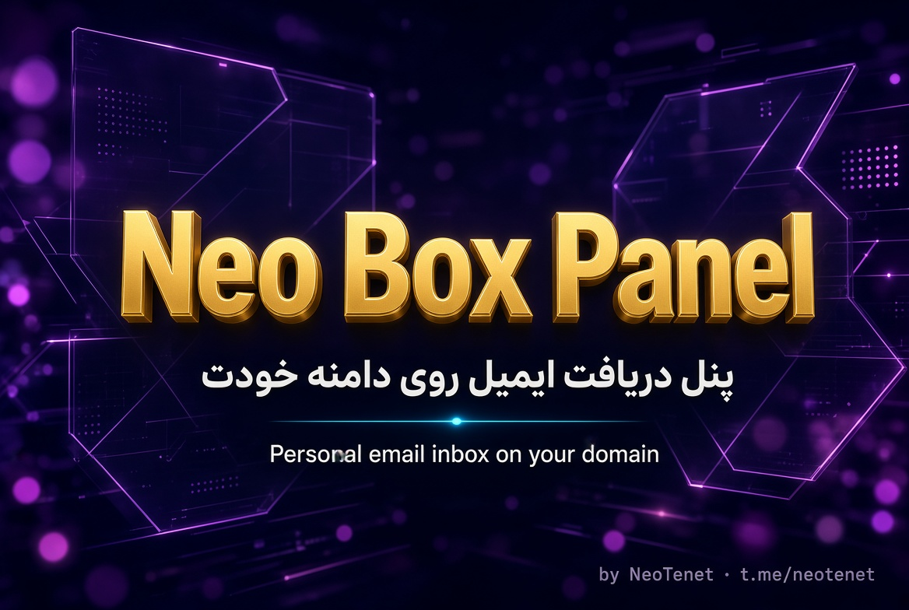
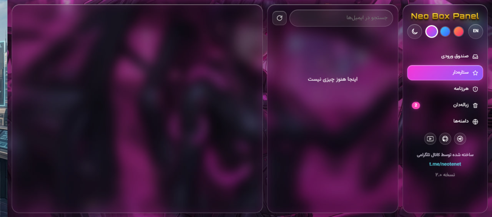
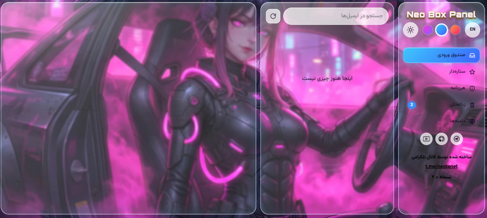
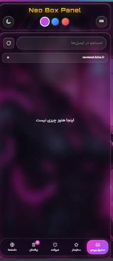
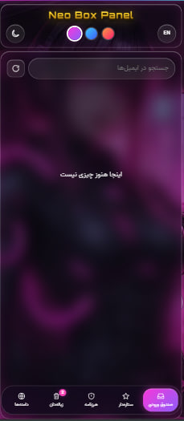
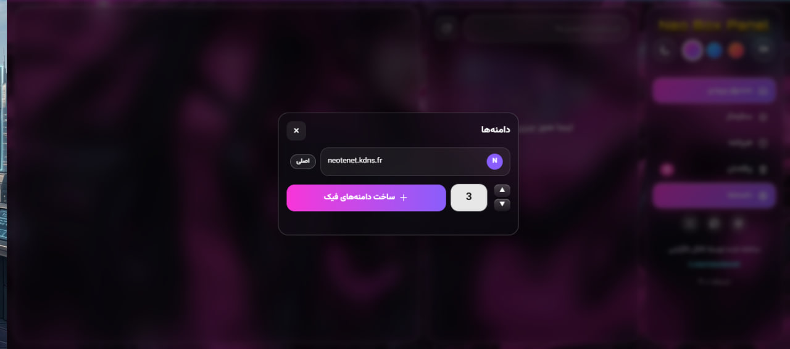

  

<h1 align="center">Neo Box Panel</h1>

  <strong>پنل دریافت ایمیل روی دامنه خودت</strong> 
  Personal email inbox on your own domain

  
  
  

  <a href="#-فارسی">🇮🇷 فارسی</a> ·
  <a href="#-english">🇬🇧 English</a>

---

## 🇮🇷 فارسی

### این پنل چیست؟

**Neo Box Panel** یک پنل وب برای **دریافت** ایمیل روی دامنه شخصی است.  
می‌توانید روی دامنه اصلی و زیردامنه‌های فیک ایمیل بگیرید و همه را در یک صندوق ببینید.

| هست | نیست |
|-----|------|
| دریافت ایمیل | ارسال ایمیل از داخل پنل |
| دامنه‌های فیک نامحدود | نیاز به سرور جدا |
| کار روی موبایل و دسکتاپ | — |

> کپی‌برداری بدون ذکر منبع مجاز نیست.  
> منبع: [github.com/NeoTenet/Privet_Mail_box_Vip](https://github.com/NeoTenet/Privet_Mail_box_Vip)

---

### پیش‌نمایش

| دسکتاپ شب | دسکتاپ روز |
|-----------|------------|
|  |  |

| موبایل شب | موبایل روز |
|-----------|------------|
|  |  |

| پنجره دامنه‌ها |
|----------------|
|  |

---

### امکانات نسخه ۲.۰

- سه تم: Neon · Ocean · Ember  
- حالت شب و روز + زبان فارسی / انگلیسی  
- مودال کشویی برای مدیریت دامنه‌ها  
- دکمه رفرش لیست ایمیل  
- نسخه موبایل با منوی پایین  
- عنوان طلایی و رابط شیشه‌ای  

---

### پیش‌نیازها

1. یک دامنه که Nameserver آن روی **Cloudflare** باشد  
2. اکانت Cloudflare (پلن رایگان کافی است)  

---

### راه‌اندازی کامل (صفر تا صد)

#### ۱) ساخت دیتابیس D1

1. داشبورد Cloudflare → **Storage & Databases** → **D1 SQL Database**  
2. **Create** → نام: `postbox`  
3. Create  

#### ۲) ساخت Worker و آپلود کد

1. **Workers & Pages** → **Create** → **Create Worker**  
2. نام: `postbox` → **Deploy**  
3. **Edit code** → کل کد پیش‌فرض را پاک کنید  
4. محتوای `worker.js` را از [Releases](../../releases) دانلود و کامل پیست کنید  
5. **Deploy**  

> فایل حدود ۱۷۰ کیلوبایت است؛ ادیتور ممکن است کمی کند شود.

#### ۳) اتصال دیتابیس (Binding)

1. Worker → **Settings** → **Bindings** → **Add**  
2. نوع: **D1 database**  
3. **Variable name** دقیقاً: `DB`  
4. دیتابیس: `postbox`  
5. ذخیره  

جدول‌ها به‌صورت خودکار ساخته می‌شوند.

#### ۴) متغیرها (Variables and Secrets)

مسیر: Worker → **Settings** → **Variables and Secrets**

| نام | نوع | توضیح |
|-----|-----|--------|
| `PANEL_PASSWORD` | Secret | رمز ورود به پنل |
| `MAIN_DOMAIN` | Text | دامنه اصلی، مثلاً `example.com` |
| `CF_ZONE_ID` | Text | Zone ID دامنه (صفحه Overview دامنه، سمت راست) |
| `CF_API_TOKEN` | Secret | توکن API با دسترسی Email Routing |

بعد از تنظیم متغیرها یک‌بار دیگر **Deploy** بزنید.

##### ساخت توکن API

1. [API Tokens](https://dash.cloudflare.com/profile/api-tokens) → **Create Token** → **Create Custom Token**  
2. دسترسی‌ها:

| Permission | Access |
|------------|--------|
| Zone → Email Routing | **Edit** |
| Zone → Zone | **Read** |

3. Zone Resources → Include → Specific zone → دامنه خودتان  
4. Create Token → توکن را کپی و در `CF_API_TOKEN` بگذارید  

#### ۵) Email Routing

1. دامنه را در Cloudflare باز کنید  
2. **Email** → **Email Routing** → **Get started / Enable**  
3. رکوردهای MX و TXT را تأیید کنید  
4. تب **Routing rules** → **Catch-all address**  
5. Action: **Send to a Worker** → Worker: `postbox` → Save / Enable  

اگر داشبورد جدید است، مسیر ممکن است این باشد:  
**Compute** → **Email Service** → **Email Routing**

#### ۶) آدرس پنل (Custom Domain)

1. Worker → **Settings** → **Domains & Routes**  
2. فقط **+ Add Domain** را بزنید (نه Add Route)  
3. مثلاً: `panel.example.com`  
4. صبر کنید تا **Active** شود  
5. باز کنید: `https://panel.example.com`  

> اسم را `mail` نگذارید تا با ایمیل قاطی نشود.

#### ۷) ورود و دامنه‌های فیک

1. با رمز `PANEL_PASSWORD` وارد شوید  
2. **دامنه‌ها** → تعداد را انتخاب → ساخت دامنه فیک  
3. اگر نوشت «نیاز به فعال‌سازی»:

\`\`\`
Cloudflare → دامنه → Email → Email Routing → Settings → Subdomains → Add
\`\`\`

دامنه فیک را کامل بنویسید (مثلاً `abc123.example.com`) و Add کنید.  
وقتی Status = **Enabled** شد، در پنل **علامت فعال** را بزنید.

#### ۸) تست دریافت

از جیمیل بفرستید به:

\`\`\`
test@دامنه-اصلی.com
\`\`\`

یا:

\`\`\`
test@زیردامنه-فیک.دامنه-اصلی.com
\`\`\`

چند ثانیه بعد باید در **صندوق ورودی** پنل بیاید.

---

### نکات مهم

- پنل فقط **دریافت** می‌کند؛ برای ارسال از جیمیل استفاده کنید  
- همیشه فرمت آدرس: \`اسم@دامنه\` (بدون اسم قبل از @ کار نمی‌کند)  
- هر دامنه فیک جدید را اول در Cloudflare → Subdomains اضافه کنید  

---

### عیب‌یابی

| مشکل | راه‌حل |
|------|--------|
| ایمیل نمی‌رسد | Catch-all روی Worker باشد؛ ساب‌دامین Enabled باشد |
| Authentication error | توکن API را با دسترسی Email Routing → Edit دوباره بسازید |
| پنل بالا نمی‌آید | از **Add Domain** استفاده کرده باشید نه Add Route |
| منوها خالی است | Deploy کامل + رفرش سخت (\`Ctrl+Shift+R\`) |

لاگ خطا: Worker → **Logs**

---

### دانلود کد

کد Worker فقط در بخش **Releases** قرار دارد:

**[دانلود worker.js از Releases](../../releases)**

---

### سازنده

ساخته شده توسط **NeoTenet**

- تلگرام: [t.me/neotenet](https://t.me/neotenet)  
- گیت‌هاب: [github.com/NeoTenet](https://github.com/NeoTenet)  
- یوتیوب: [youtube.com/@Neo_Tenet](https://www.youtube.com/@Neo_Tenet)  

---

## 🇬🇧 English

### What is this?

**Neo Box Panel** is a web panel to **receive** emails on your own domain — including unlimited fake subdomains — running on Cloudflare’s free tier.

| Does | Does not |
|------|----------|
| Receive email | Send email from the panel |
| Unlimited fake domains | Need a separate server |
| Works on mobile & desktop | — |

> Copying without credit is not allowed.  
> Source: [github.com/NeoTenet/Privet_Mail_box_Vip](https://github.com/NeoTenet/Privet_Mail_box_Vip)

---

### Preview

| Desktop Dark | Desktop Light |
|--------------|---------------|
|  |  |

| Mobile Dark | Mobile Light |
|-------------|--------------|
|  |  |

| Domains modal |
|---------------|
|  |

---

### Features (v2.0)

- Three themes: Neon · Ocean · Ember  
- Dark / light mode + Persian / English  
- Slide-up domains modal  
- Refresh button for inbox  
- Mobile bottom navigation  
- Gold 3D title & glass UI  

---

### Requirements

1. A domain with nameservers on **Cloudflare**  
2. Cloudflare account (free plan is enough)  

---

### Full setup

#### 1) Create D1 database

Cloudflare → **Storage & Databases** → **D1** → Create → name: \`postbox\`

#### 2) Create Worker

**Workers & Pages** → Create Worker → name \`postbox\` → Deploy  
Edit code → paste \`worker.js\` from [Releases](../../releases) → Deploy

#### 3) Bind database

Settings → Bindings → Add → D1 → Variable name: **\`DB\`** → select \`postbox\`

#### 4) Variables

| Name | Type | Description |
|------|------|-------------|
| \`PANEL_PASSWORD\` | Secret | Login password |
| \`MAIN_DOMAIN\` | Text | Your main domain |
| \`CF_ZONE_ID\` | Text | Zone ID from domain Overview |
| \`CF_API_TOKEN\` | Secret | Token with Email Routing Edit |

API token: Zone → Email Routing → **Edit**, Zone → Zone → **Read**, scoped to your zone.

#### 5) Email Routing

Domain → **Email** → **Email Routing** → Enable  
Routing rules → **Catch-all** → Action: **Send to a Worker** → \`postbox\`

#### 6) Panel address

Worker → Settings → Domains & Routes → **+ Add Domain** (not Add Route)  
Example: \`panel.example.com\` → open \`https://panel.example.com\`

#### 7) Fake domains

In panel → Domains → generate  
If “needs activation”: Cloudflare → Email Routing → Settings → **Subdomains** → Add → then confirm in panel

#### 8) Test

Send from Gmail to \`test@yourdomain.com\` or \`test@fake.yourdomain.com\`

---

### Download

Get \`worker.js\` only from **[Releases](../../releases)**.

---

### Author

Built by **NeoTenet**

- Telegram: [t.me/neotenet](https://t.me/neotenet)  
- GitHub: [github.com/NeoTenet](https://github.com/NeoTenet)  
- YouTube: [youtube.com/@Neo_Tenet](https://www.youtube.com/@Neo_Tenet)  
